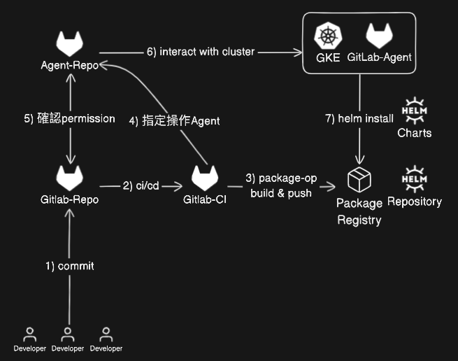

[To Main](https://github.com/Sakuard/tech_logs/blob/main/README.md)<br/>[Demo Repo](https://gitlab.com/matt.lab/git-agent)

### GitOps: Build and Deploy on K8S via Helm

<span id="home"></span>

<!--  -->


>Requirement

- Gitlab Account
- Acdess to a K8S Cluster
---

> Flow

1. Install GitLab-Agent
2. Create Helm Charts
3. Create Helm-deploy pipeline
4. Deploy with Helm

> Helm Command
```bash=
# create defaul helm template
helm create <chart_name>
# ex. helm create demo

# install helm
helm install <Release Name> <chart_name>
# ex. helm install demo-app ./demo

# uninstall
helm uninstall <Release Name>
# ex. helm uninstall demo-app

# push helm to registory
helm package <chart_name_dir>
# ex. helm package ./demo/

```


#### Step by Step
1. Install GitLab-Agent ( [note](https://github.com/Sakuard/tech_logs/blob/main/Gitlab/GitLab-Agent.md) )
2. Create and test helm locally ( [ref](#helm-structure) )
```bash=
# build a default helm tempalte
helm create demo
# cd templates; rm -rf *;
# 把在GitLab-Agent這個repo實作時，建立個K8S.yml複製過來後
helm install demo-app ./demo
# after comfirm its work, uninstall
helm uninstall demo-app
```
3. Push Helm Charts to Helm Repository ( [ref](https://docs.gitlab.com/ee/user/packages/helm_repository/) )
[](https://docs.gitlab.com/ee/user/packages/helm_repository/)
```bash=
# package your helm 
helm package ./demo/
# push to helm-repo
curl --fail-with-body --request POST \
     --form 'chart=@mychart-0.1.0.tgz' \
     --user <username>:<personal_access_token> \
     https://gitlab.com/api/v4/projects/<project_id>/packages/helm/api/<channel>/charts

```
<!-- [](https://helm.sh/docs/helm/helm_package/#helm-package) -->
4. GitLab-Pipeline
```yaml=
variables:
  KUBE_CONTEXT: matt.lab/git-agent/agent:agent

stages:
  - pre-build
  - build
  - deploy
  - destroy

Extract:
  stage: pre-build
  image: python
  rules:
    - if: '$CI_COMMIT_BRANCH || $CI_PIPELINE_SOURCE == "merge_request_event"'
  script:
    - echo PACKAGE_VERSION=$(python3 $CI_PROJECT_DIR/package-name.py) >> build.env
    - echo PACKAGE_NAME=$(python3 $CI_PROJECT_DIR/chart-name.py) >> build.env

  artifacts:
    reports:
      dotenv: build.env

Publish-Helm:
  stage: build
  image:
    name: alpine/helm:latest
    entrypoint: ['']
  rules:
    - if: '$CI_COMMIT_BRANCH || $CI_PIPELINE_SOURCE == "merge_request_event"'
  script:
    - echo "Build Started"
    - helm package $CI_PROJECT_DIR/$PACKAGE_NAME
    - 'curl --fail-with-body --request POST --user gitlab-ci-token:$CI_REGISTRY_PASSWORD --form "chart=@${PACKAGE_VERSION}" "${CI_API_V4_URL}/projects/${CI_PROJECT_ID}/packages/helm/api/demo/charts"'
    - echo "Chart Package Published"
  
Deploy-Helm:
  stage: deploy
  image: 
    name: dtzar/helm-kubectl
    entrypoint: ['']
  rules:
    - if: '$CI_PIPELINE_SOURCE == "merge_request_event" && $CI_MERGE_REQUEST_TARGET_BRANCH_NAME == "main"'
    - if: '$CI_COMMIT_REF_NAME == "main"'
  script:
    - kubectl config get-contexts
    - kubectl config use-context $KUBE_CONTEXT
    - helm repo add --username $CI_REGISTRY_USER --password $CI_REGISTRY_PASSWORD login-project "${CI_API_V4_URL}/projects/${CI_PROJECT_ID}/packages/helm/demo"
    - helm repo update 
    #- helm repo list
    - helm upgrade --install ${PACKAGE_NAME} login-project/${PACKAGE_NAME}
    - kubectl get pods
    - kubectl get svc

Destroy-Helm:
  stage: destroy
  image: 
    name: dtzar/helm-kubectl
    entrypoint: ['']
  rules:
    - if: '$CI_PIPELINE_SOURCE == "merge_request_event" && $CI_MERGE_REQUEST_TARGET_BRANCH_NAME == "main"'
    - if: '$CI_COMMIT_REF_NAME == "main"'
  script:
    - echo "Destroy Started"
    - kubectl config get-contexts
    - kubectl config use-context $KUBE_CONTEXT
    - helm repo add --username $CI_REGISTRY_USER --password $CI_REGISTRY_PASSWORD login-project "${CI_API_V4_URL}/projects/${CI_PROJECT_ID}/packages/helm/demo"
    - helm repo update
    - helm repo list
    - helm uninstall ${PACKAGE_NAME}
    - kubectl get pods
    - kubectl get svc
  when: manual
```

Ref:
- [How to Build and Deploy an app Helm Chart on Kubernetes Cluster with GitLab CI/CD](https://www.youtube.com/watch?v=qSbE7NOXm8U)
- <span id="helm-structure">Helm-Structure explain</span>
```bash=
# It create a folder with <Chart_Name>
helm create <chart_name>

# folder structure
.
└── demo                 # Chart Name
    ├── Chart.yaml       # Info abt Chart
    ├── charts        
    ├── templates        # K8S manifests
    │   ├── NOTES.txt    # Optional
    │   ├── _helpers.tpl
    │   ├── deployment.yaml       # ───
    │   ├── hpa.yaml              #  │
    │   ├── ingress.yaml          # K8S manifests
    │   ├── service.yaml          #  │
    │   ├── serviceaccount.yaml   # ───
    │   └── tests
    │       └── test-connection.yaml
    └── values.yaml      # Default config for chart
```

[回頭](#home)