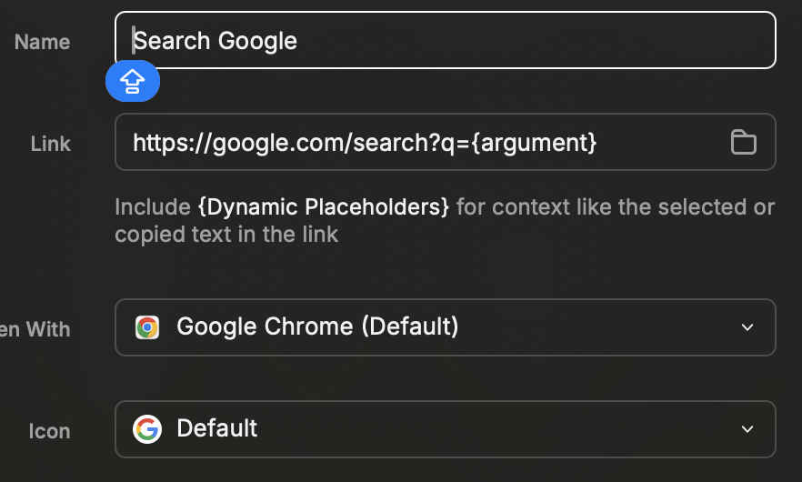

Set up
-

### 取代原生的 spotlight
1. 打開系統設定 >> 搜尋 spotlight >> 鍵盤快速鍵
2. Spotlight 取消快捷鍵設定
3. 打開 Raycast 完成 pre-set >> 替換 hot-key

Raycast
-
- 取代 Mac 原生的 Spotlight
- 對 application 原生支援快捷搜尋
- 對 Browser 建立[快捷連結](#hot-link)
- [建立快捷](#hot-query) search 的變數帶入
- LeftHalf / RightHalf
- Clickboard
會列出在 Memory 內存有記憶的，最近有複製的內容
- snip >> create snippet
建立快捷，並取代冗長的文字
- Raycast Store

Raycast >> Extension

可以參考系統 Default 提供 google search 的方式
<!--  -->

設定Alias
<!--  -->

呼叫 Raycast 後，已設定的 Alias 後 enter
即可搜尋

Ref:
-
- [Raycast 讓一切操作在彈指之間輕鬆完成](https://www.youtube.com/watch?v=x6IcLAdUjSI)