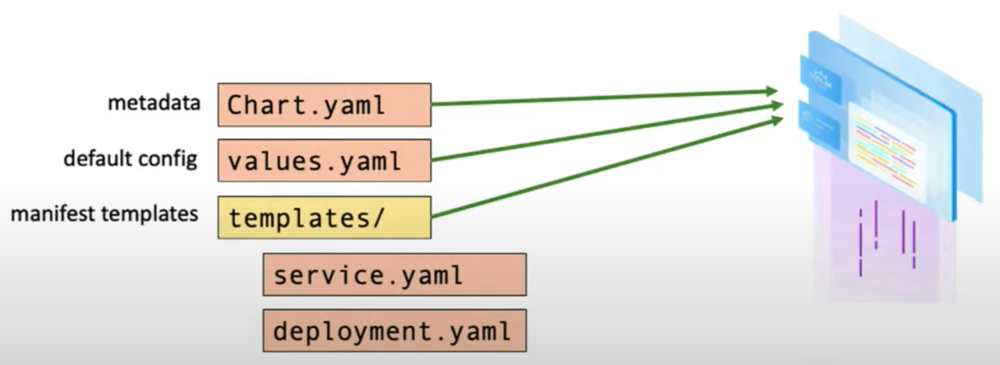
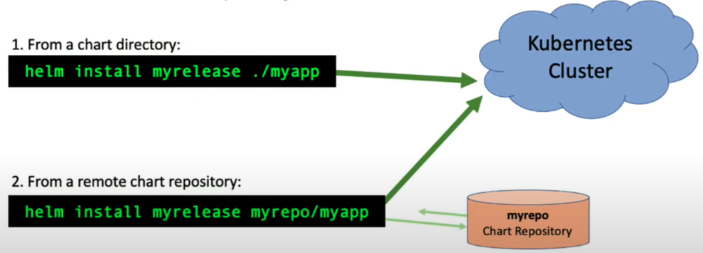

<span id="home"></span>

### Helm

> Helm is a package manager for K8S

### And apt example
```bash=
# how to install mariadb?
sudo apt update
sudo apt install mariadb-server

# how to install postgres?
sudo apt-get install wget ca-certificates
wget --quiet -0 - https://www.postgresql.org/mdeia/keys/ACCC4CF8.asc | sudo apt-key add -
sudo sh -c 'echo "deb http://apt.postgresql.org/pub/repos/apt/`lsb_release -cs`-pgdg main" >> /etc/apt/sources.list.d/pgdg.list'

sudo apt-get update
sudo apt-get install postgresql postgresql-contrib
```
With Helm
```bash=
# how to install mariadb?
helm repo add bitnami https://charts.bitnami.com
helm install mymaria bitnami/mariadb
```
Hosting numbers of service with Kubernetes will make you feel yourself as a YAML-Engineer

<!--  -->


### And Helm deal with the following problem good
1. YAML files management
2. Manage a package of yaml files as a application
3. Reusable K8S YAML file template
---
- Kubernetes vs Helm

<!--  -->

- How Helm works

<!--  -->


### Helm Charts
Helm packages are refferred to as **charts** - deployable units for Kubernetes-bound applications.

Charts are comprised of a collection of files (mostly YAML) at well-known locations.
<!--  -->

```bash=
# helm will generate a typical chart layout
helm create demo

# with the following file structure
demo/
├── Chart.yaml
├── charts
├── templates
│   ├── NOTES.txt
│   ├── _helpers.tpl
│   ├── deployment.yaml
│   ├── hpa.yaml
│   ├── ingress.yaml
│   ├── service.yaml
│   ├── serviceaccount.yaml
│   └── tests
│       └── test-connection.yaml
└── values.yaml

5 directories, 10 files
```
This is a basic Chart.yaml example
```yaml=
# Source: Chart.yaml
apiVersion: v2
name: demo
description: A Helm chart for Kubernetes
type: application
version: 0.1.1
appVersion: 1.16.0

# List any chart dependencies
dependencies:
- name: mariadb
  version: 7.0.1
  repository: https://charts.bitnami.com
```
```yaml=
# Source: values.yaml
# any variable you'll need to use all defind in this yaml
replicaCount: 1

image:
    repository: nginx
    tag: 1.17.5-alpine
    
service:
    type: ClusterIP
    port: 80
    
secretRef: my-existing-secret
```
This is how templates yaml use variable define in values.yaml
```yaml=
# Source: templates/deployment.yaml
apiVersion: apps/v1
kind: Deployment
metadata:
  name: {{ include "demo.fullname "}}
  labels:
 {{- include "demo.labels" . | nindent 4}}
spec:
  # defined in values.yaml
  replicas: {{ .Values.replicaCount }}
  selector:
    matchLabels:
      {{- include "demo.selectorLabels" . | nindent 6 }}
  template:
    metadata:
      labels:
        {{-include "demo.selectorLabels" . | nindent 8 }}
    spec:
      containers:
        - name: {{ .Chart.Name }}
          # defined in values.yaml
          image: {{ .Values.image.repo }}:{{ .Values.image.tag }}
```
```yaml=
# Source: templates/_helpers.tpl (optional)

{{- define "demo.selectorLabels" -}}
app.kubernetes.io/name: {{ include "demo.name" . }}
app.kubernetes.io/instance: {{ .Release.Name }}
{{- end -}}
```
```yaml=
# Source: templates/test/test-connection.yaml
apiVersion: v1
kind: Pod
metadata:
  name: "{{ include "demo.fullname" . }}-test-connection"
  labels:
{{ include "demo.labels" . | nindent 4 }}
  annotations:
    "helm.sh/hook": test-success
  spec:
    containers:
      - name: wget
        image: busybox
        command: ['wget']
        args: ['{{ include "demo.fullname" .}}:{{ .Values.service.port }}']
        restartPolicy: Never
```

### Helm Operate
- Install
<!--  -->


```bash=
# From a chart directory:
helm install myrelease ./mydemo

# From a remote chart repo:
helm install myrelease mydemo/demo

# Using comstom Values
# 1. Using a values files:
helm isntall myrelease ./mydemo -f values.yaml
# 2. Using indiviual key-value pair:
helm install myrelease ./mydemo --set image.tag=latest
# 3. Advanced usage:
helm install myrelease ./mydemo \
    -f staging.yaml \
    -f us.east-1.yaml \
    --set tracing.enabled=true
```
- rollback
Helm tracks every revision made on releases. When something goes wrong, revert back to a working version.
```bash=
helm rollback myrelease 1
```
- delete

```bash=
helm delete myrelease
```
- diff
[***need  plugin installed***](#plugin)
```bash=
helm diff upgrade <release-name> <chart_dir> -f <new_chart_val>
```
- package and push

```bash=
# 打包 helm chart >> 會產生一個 demo.tgz
helm package <chart_name>

# 推到 Registry, 這邊以 GitLab 為範例
helm repo add --username <username> --password <password> <project-name> "<gitlab_base_url>/projects/<PROJECT_ID>/packages/helm/<channel>"
```

- [helm hub](https://artifacthub.io/)
---
### Templates
Files under the templates/ directory are treated as dynamic YAML templates using the Go template language with some added functinoality.

Yaml templating prevents config duplication, and allows you to install the same chart in dev, staging, and productino environments with different variable value set.

### Values
Values files contain a collectino of key-values that represent the configuration settings for a chart.

**values.yaml** is the default, baseline values files.

Override default configuration of the chart by using additional values files or individual key-value pairs.

### Templates + Values
```yaml=
# Source: templates/deployment.yaml
apiVersion: apps/v1
kind: Deployment
metadata:
  name: {{ include "myapp.fullname" . }}
  labels:
    {{- include "myapp.labels" . | nindent 4 }}
spec:
  replicas: {{ .Values.replicaCount }}
  selector:
    matchLabels:
      {{- include "myapp.selectorLabels" . | nindent 6 }}
  template:
    metadata:
      labels:
        {{- include "myapp.selectorLabels" . | nindent 8 }}
    spec:
      containers:
        - name: {{ .Chart.Name }}
          image: {{ .Values.image.repository }}:{{ .Values.image.tag }}
```
```yaml=
# Source: values.yaml
replicaCount: 1

image:
  repository: nginx
  tag: 1.17.5-alpine

service:
  type: ClusterIP
  port: 80

secretRef: existing-secret
```
```yaml=
# Source: myvals.yaml
image:
  tag: customtag
```
Result with the following command
``` helm install myrelease ./mychart -f values.yaml -f myvals.yaml```
( myvals.yaml will override values.yaml with the command )
```yaml=
apiVersion: apps/v1
kind: Deployment
metadata:
  name: myrelease-myapp
  labels:
    helm.sh/chart: myapp-0.1.0
    app.kubernetes.io/name: myapp
    app.kubernetes.io/instance: myrelease
    app.kubernetes.io/version: "1.16.0"
    app.kubernetes.io/managed-by: Helm
spec:
  replicas: 1
  selector:
    matchLabels:
      app.kubernetes.io/name: myapp
      app.kubernetes.io/instance: myrelease
  template:
    metadata:
      labels:
        app.kubernetes.io/name: myapp
        app.kubernetes.io/instance: myrelease
    spec:
      containers:
        - name: myapp
          image: nginx:customtag
```

### Component / command

---
#### component

- chart
- template
- values
- release

#### command

- helm diff
[`need to install diff plugin`](#plugin)
- helm upgrade
    - ----timeout : 超時
    ```bash=
    helm upgrade myrelease ./mychart --timeout 10m (default value)
    ```
    - ----reuse-values : 重用上次部署的值
    ```bash=
    helm upgrade myrelease ./mychart --reuse-values -f myvals.yaml
    ```
    - ----install : 若該release不存在則install
    ```bash=
    helm upgrade myrelease ./mychart --install -f myvals.yaml
    ```
    - ----force : 強制替換
    ```bash=
    helm upgrade myrelease ./mychart --force -f myvals.yaml
    ```
    - ----dry--run : 模擬運行，顯示將會執行的操作，而非應用
    ```bash=
    helm upgrade myrelease ./mychart --dry-run -f myvals.yaml
    ```
    - ----atomic : 若 upgrade 失敗，rollback
    (which situation will upgrade failed)
    ```bash=
    helm upgrade myrelease ./mychart --atomic -f myvals.yaml
    ```
- helm list : 所有 release 列表
- helm get : 取得已安裝的 release detail
(helm get , flag)
```bash=
helm get all myrelease
```
<br/>

### Helm take charge of service deployed by kubectl 
```bash=
# deployment
kubectl annotate deployment <deployment-name> meta.helm.sh/release-name=<release-name> --overwrite
kubectl annotate deployment <deployment-name> meta.helm.sh/release-namespace=<namespace> --overwrite
kubectl label deployment <deployment-name> app.kubernetes.io/managed-by=Helm --overwrite

# service
kubectl annotate service <service-name> meta.helm.sh/release-name=<release-name> --overwrite
kubectl annotate service <service-name> meta.helm.sh/release-namespace=<namespace> --overwrite
kubectl label service <service-name> app.kubernetes.io/managed-by=Helm --overwrite

@ configMap
kubectl annotate configmap <configmap-name> meta.helm.sh/release-name=<release-name> --overwrite
kubectl annotate configmap <configmap-name> meta.helm.sh/release-namespace=<namespace> --overwrite
kubectl label configmap <configmap-name> app.kubernetes.io/managed-by=Helm --overwrite

# HPA
kubectl annotate hpa <hpa-name> meta.helm.sh/release-name=<release-name> --overwrite
kubectl annotate hpa <hpa-name> meta.helm.sh/release-namespace=<namespace> --overwrite
kubectl label hpa <hpa-name> app.kubernetes.io/managed-by=Helm --overwrite

```

### Ref:
---
- <span id="plugin">Plugin install</span>
```bash=
# helm diff plugin install
helm plugin install https://github.com/databus23/helm-diff
```
- [What is Helm?](https://www.youtube.com/watch?v=fy8SHvNZGeE&t=11s)
- [An Intro to Helm @CNCF](https://www.youtube.com/watch?v=Zzwq9FmZdsU)
- [使用Helm管理Kubernetes](https://jimmysong.io/kubernetes-handbook/practice/helm.html)
- Couchbase
    - [Overview](https://docs.couchbase.com/cloud-native-database/helm-overview.html)
    - [Helm Management Guide](https://docs.couchbase.com/operator/current/helm-managing-guide.html)

[Back](#home)

docker image --set
kubectl deploy >> helm 接手